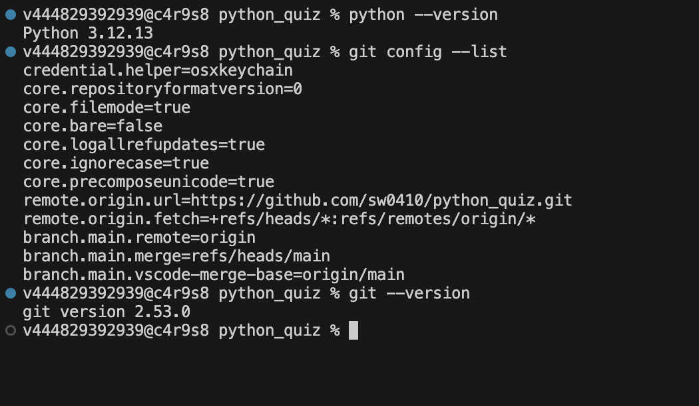
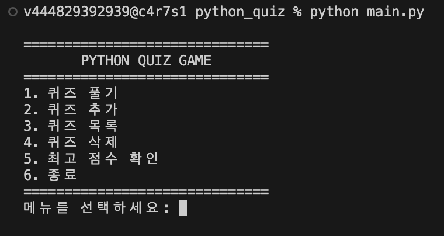
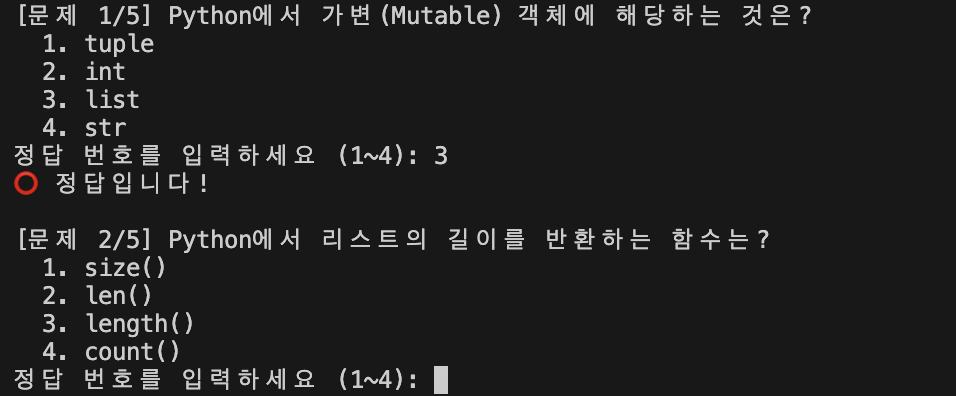
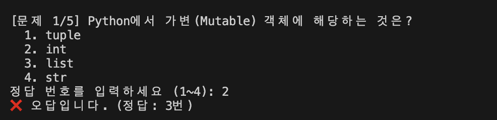
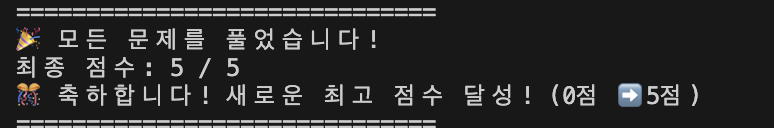
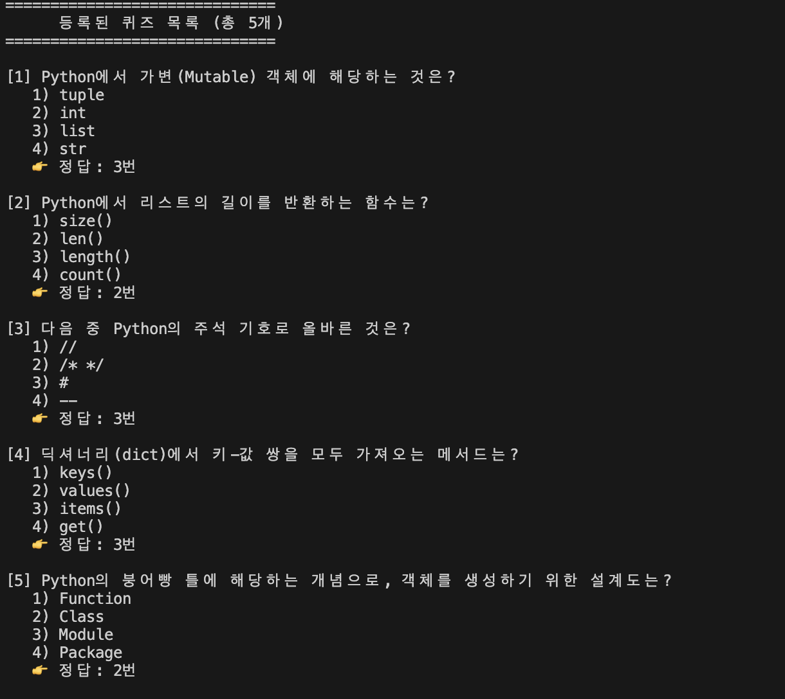
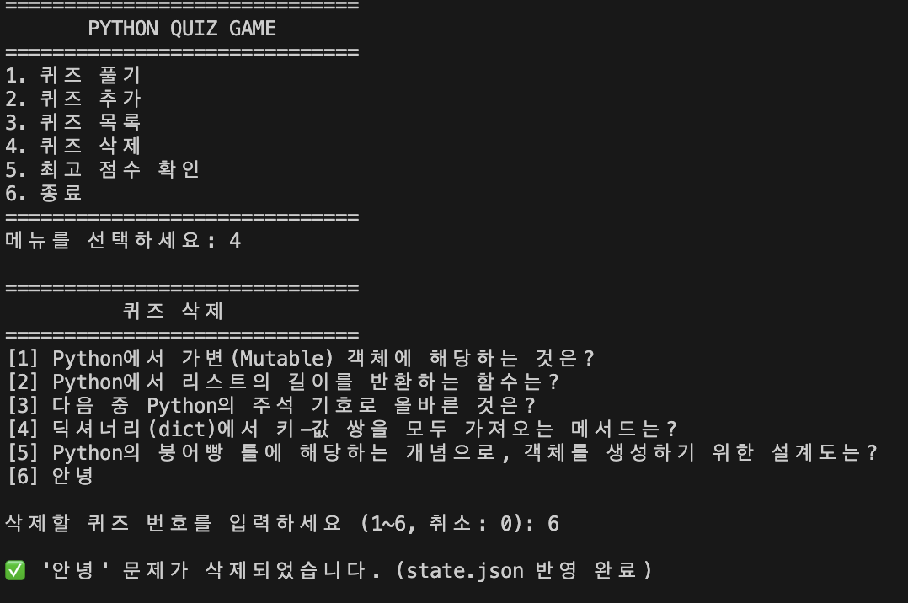
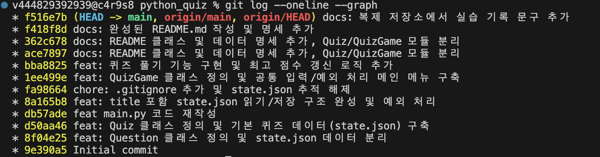
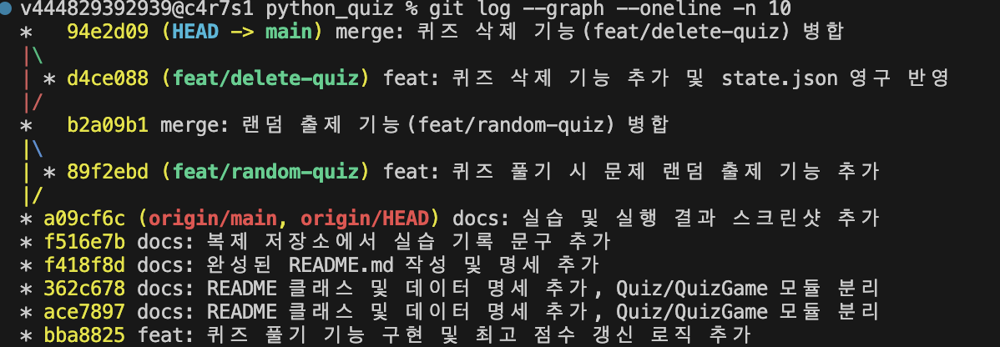

# Python 콘솔 퀴즈 게임 (CLI Quiz App)

객체지향 프로그래밍(OOP), 파일 입출력 및 예외 처리, 데이터 영속성, 그리고 Git 브랜치 및 머지 전략을 직접 설계하고 구현한 파이썬 콘솔 기반 퀴즈 애플리케이션입니다.

---

## 목차

1. [프로젝트 개요](#1-프로젝트-개요)
2. [퀴즈 주제 선정 이유](#2-퀴즈-주제-선정-이유)
3. [실행 방법](#3-실행-방법)
4. [기능 목록](#4-기능-목록)
5. [파일 구조](#5-파일-구조)
6. [데이터 파일 설명 (state.json)](#6-데이터-파일-설명-statejson)
7. [Git 브랜치 전략 및 머지 이력](#7-git-브랜치-전략-및-머지-이력)
8. [학습 및 개념 회고](#8-학습-및-개념-회고-key-takeaways)

---

## 1. 프로젝트 개요

| 항목 | 내용 |
| --- | --- |
| **개발 언어** | Python 3.12.13 |
| **사용 라이브러리** | 표준 라이브러리(`json`, `os`, `sys`, `random`) — 별도 외부 패키지 설치 불필요 |

**주요 목표**

- 객체지향 원칙을 적용한 퀴즈 모델(`Quiz`) 및 게임 엔진(`QuizGame`) 모듈화
- JSON 기반 데이터 영속성 유지 및 파일 손상/부재 시 자동 복구 로직 구현
- 사용자 입력 예외 처리(`try/except`)를 통한 프로그램 비정상 종료(Crash) 방지
- 기능별 브랜치 분기(`feat/*`) 및 머지(`--no-ff`)를 통한 협업 워크플로우 경험

**개발 환경 확인**


> Python 및 Git 버전, 원격 저장소 연결 상태를 확인한 화면입니다.

---

## 2. 퀴즈 주제 선정 이유

**주제**: 파이썬 핵심 기초 및 CS 지식 (Python & CS Basics)

**선정 배경**

파이썬의 가변/불변 객체 특성, 자료구조(`dict`, `list`), 파일 입출력 모드, 객체지향 기초 등 프로그래밍 학습에서 반드시 짚고 넘어가야 할 핵심 개념을 직접 퀴즈로 풀며 점검할 수 있도록 구성했습니다.

---

## 3. 실행 방법

추가 패키지 설치 없이 기본 파이썬 인터프리터로 바로 실행할 수 있습니다.

```bash
# 1. 저장소 복제 (Clone)
git clone <저장소-URL>
cd python_quiz

# 2. 프로그램 실행
python main.py
```

**프로그램 실행 화면**


> `python main.py` 실행 시 나타나는 메인 메뉴입니다.

---

## 4. 기능 목록

| 기능 | 설명 |
| --- | --- |
| **1. 퀴즈 풀기 (랜덤 출제)** | 등록된 문제를 무작위 순서(`random.shuffle`)로 출제하며, 문제마다 즉각적인 정오답 판정 및 해설을 제공합니다. 완료 시 최고 점수를 갱신합니다. |
| **2. 퀴즈 추가** | 질문, 4개의 선택지, 정답 번호를 대화형으로 입력받아 새 퀴즈를 생성하고 `state.json`에 영구 저장합니다. |
| **3. 퀴즈 목록 조회** | 현재 시스템에 등록된 모든 퀴즈의 질문, 선택지, 정답을 번호순으로 확인합니다. |
| **4. 퀴즈 삭제** | 등록된 퀴즈 목록을 확인하고 원하는 문제를 선택하여 삭제하며, 파일(`state.json`)에 즉시 영구 반영합니다. |
| **5. 점수 관리** | 현재까지 기록된 최고 점수를 확인하거나 필요 시 0점으로 초기화합니다. |
| **6. 자동 복구 엔진** | `state.json` 파일이 삭제되거나 손상되어도 내장 기본 퀴즈(`DEFAULT_QUIZZES`)를 통해 자동으로 새 파일을 생성하고 복원합니다. |

### 실행 화면

**퀴즈 풀기 — 정답 판정**


> 정답을 맞혔을 때의 즉각적인 판정 화면입니다.

**퀴즈 풀기 — 오답 판정**


> 오답 시 정답 번호와 함께 안내 메시지를 보여줍니다.

**퀴즈 풀기 — 결과 및 최고 점수 갱신**


> 모든 문제를 푼 뒤 최종 점수와 최고 점수 갱신 여부를 보여줍니다.

**퀴즈 목록 조회**


> 등록된 모든 퀴즈의 질문, 선택지, 정답을 확인하는 화면입니다.

**퀴즈 삭제**


> 삭제할 퀴즈를 선택하고 `state.json`에 즉시 반영되는 화면입니다.

---

## 5. 파일 구조

```text
python_quiz/
├── main.py          # 프로그램 진입점 (CLI 실행)
├── quiz.py          # Quiz 데이터 모델 클래스 및 기본 퀴즈 데이터셋(DEFAULT_QUIZZES)
├── quiz_game.py     # 게임 엔진 (랜덤 출제, 퀴즈 삭제, 파일 입출력, 입력 검증)
├── state.json       # 퀴즈 목록 및 최고 점수가 영구 보관되는 JSON 데이터 파일
├── .gitignore       # Git 추적 제외 설정
└── README.md        # 프로젝트 명세 및 학습 회고 문서
```

---

## 6. 데이터 파일 설명 (`state.json`)

- **파일 경로**: 프로젝트 루트 디렉터리의 `state.json`
- **역할**: 게임 종료 후에도 사용자가 추가/삭제한 퀴즈 목록과 달성한 최고 점수(`best_score`)를 영구 보관합니다.

### 데이터 스키마 (JSON 구조)

```json
{
  "quizzes": [
    {
      "question": "Python에서 가변(Mutable) 객체에 해당하는 것은?",
      "choices": ["tuple", "int", "list", "str"],
      "answer": 3
    }
  ],
  "best_score": 5
}
```

### 필드 명세

| 필드 | 설명 |
| ---  | --- |
| `quizzes` | 등록된 퀴즈 객체 목록 |
| `question` | 퀴즈 문제 텍스트 |
| `choices`  | 1번부터 4번까지의 객관식 보기 리스트 |
| `answer`  | 올바른 정답 번호 (1~4) |
| `best_score` | 플레이어가 달성한 역대 최고 점수 |

### 파일 부재 및 손상 대처

- `os.path.exists()`를 통해 파일 존재 여부를 먼저 확인하고, 파일이 없을 경우 기본 데이터셋으로 즉시 새 `state.json`을 생성합니다.
- 파일 내부 문법 오류(`JSONDecodeError`)나 누락이 발생해도 `try/except` 블록을 통해 안전하게 기본 상태로 복구합니다.

---

## 7. Git 브랜치 전략 및 머지 이력

독립된 기능 단위로 브랜치를 분기하여 개발한 뒤 `main` 브랜치에 병합하는 Git Flow 방식을 적용했습니다.

### 브랜치 구성

| 브랜치 | 설명 |
| --- | --- |
| `main` | 상용/배포 가능한 안정적인 메인 코드라인 |
| `feat/random-quiz` | 문제 순서 무작위 셔플 출제 기능 개발 |
| `feat/delete-quiz` | 퀴즈 삭제 및 파일 영구 반영 기능 개발 |

### 머지 히스토리 다이어그램

```text
*   b2a09b1 (HEAD -> main) merge: 퀴즈 삭제 기능(feat/delete-quiz) 병합
|\  
| * e4f12ab (feat/delete-quiz) feat: 퀴즈 삭제 기능 추가 및 state.json 영구 반영
|/  
*   9a82cd1 merge: 랜덤 출제 기능(feat/random-quiz) 병합
|\  
| * 89f2ebd (feat/random-quiz) feat: 퀴즈 풀기 시 문제 랜덤 출제 기능 추가
|/  
* a09cf6c docs: 실행 화면 스크린샷 추가
...
* 9e390a5 Initial commit
```

### 실제 커밋 이력 (`git log --oneline --graph`)


> 기능별 브랜치에서 순차적으로 작업한 커밋 이력입니다.


> `feat/random-quiz`, `feat/delete-quiz` 브랜치를 `--no-ff` 옵션으로 병합한 결과, 브랜치 그래프가 분기·병합 형태로 남아 있는 것을 확인할 수 있습니다.

---
## 8. 핵심 학습 및 개념 회고 (Core Concepts & Key Learnings)

본 프로젝트를 구현하며 다룬 파이썬 기초, 객체지향 설계, 파일 입출력 및 Git 형상 관리의 핵심 정리입니다.

### 8.1 Python 기초

| 개념 | 내용 |
| --- | --- |
| **변수(Variable)** | 메모리 공간에 이름을 붙여 데이터를 저장하고 재사용하기 위해 사용합니다. (예: `current_score`, `choice`) |
| **조건문 (`if / elif / else`)** | 메뉴 선택 분기 처리 및 사용자의 정답/오답 여부에 따라 서로 다른 로직을 실행합니다. |
| **함수와 모듈화** | `def get_valid_input(prompt, min_val, max_val)`처럼 매개변수를 받아 입력을 검증하고 반환값(`return`)을 전달하는 재사용 가능한 단위로 로직을 분리합니다. |

**핵심 자료형 비교**

| 자료형 | 설명 | 사용 예 |
| --- | --- | --- |
| `int` | 정수형 데이터 | 점수, 인덱스 계산 |
| `str` | 문자열 데이터 | 질문, 선택지 텍스트 |
| `bool` | 참/거짓 논리값 (`True`/`False`) | 정답 판별 결과 |
| `list` | 순서가 있는 가변(Mutable) 연속 데이터 | `choices` 보기 목록, `quizzes` 리스트 |
| `dict` | 키-값(Key-Value) 쌍으로 이루어진 해시 기반 구조 | JSON 직렬화 데이터 매핑 |

**반복문 비교 (`for` vs `while`)**

| 구문 | 사용 시점 | 사용 예 |
| --- | --- | --- |
| `for` | 순회 횟수나 범위가 명확할 때 | 등록된 퀴즈 목록 순회, 보기 출력 |
| `while` | 조건이 만족될 때까지 반복해야 할 때 | 유효한 입력을 받을 때까지 재입력 루프 |

### 8.2 클래스와 객체 (OOP)

- **클래스(Class)와 객체(Object)**: 클래스는 퀴즈의 형태를 규정하는 '설계도'이며, 객체(인스턴스)는 그 설계도로 찍어낸 '실제 문제 데이터'입니다. 데이터와 관련 동작을 하나로 묶어(캡슐화) 전역 변수(`global`) 사용을 없애고 유지보수성을 극대화합니다.
- **`__init__` 메서드와 `self`**:
  - `__init__`: 객체가 생성될 때 속성값(`question`, `choices`, `answer`)을 초기화하는 생성자입니다.
  - `self`: 생성된 객체 자기 자신을 가리키며, 객체 고유의 속성과 메서드에 접근할 때 사용합니다.
- **속성(Attribute)과 메서드(Method)**:
  - 속성: `quiz.question`, `quiz.answer` 등 객체가 보유한 데이터
  - 메서드: `quiz.is_correct(choice)`(정답 검증), `quiz.to_dict()`(JSON 변환) 등 객체가 수행하는 동작

### 8.3 파일 입출력 및 데이터 영속성

- **파일 입출력 기본 과정**: `open()`을 통해 파일 스트림을 열고, 읽기(`"r"`) 또는 쓰기(`"w"`) 작업을 수행한 뒤 안전하게 닫습니다. `with` 문을 사용하여 작업 완료 시 파일이 자동으로 닫히도록 관리합니다.
- **JSON 형식의 필요성**: 텍스트 기반의 표준 데이터 교환 포맷으로, 사람이 읽기 쉽고 파이썬의 `dict`/`list`와 1:1로 자연스럽게 매핑되어 프로그램 종료 후에도 데이터를 영구 보관(`state.json`)하기에 적합합니다.
- **예외 처리 (`try / except`)**: `FileNotFoundError`, `json.JSONDecodeError`, `ValueError` 등 예기치 않은 오류나 잘못된 입력이 발생해도 프로그램이 비정상 종료(Crash)되지 않고 안전하게 복구(기본 데이터 로드, 재입력 유도)되도록 격리합니다.

### 8.4 Git 기초 및 협업 워크플로우

- **Git의 필요성**: 코드의 변경 이력을 시간순으로 기록하여 버전을 관리하고, 문제 발생 시 이전 시점으로 되돌리거나 여러 작업자가 충돌 없이 협업하기 위해 사용합니다.

**주요 Git 명령어 역할**

| 명령어 | 역할 |
| --- | --- |
| `git init` | 현재 디렉터리를 Git 로컬 저장소로 초기화 |
| `git add` | 수정한 파일을 커밋 대상인 스테이징 영역(Staging Area)에 등록 |
| `git commit` | 스테이징된 변경 사항을 하나의 의미 있는 버전 단위로 기록 |
| `git push` | 로컬 저장소의 커밋 이력을 원격 저장소(GitHub)로 업로드 |
| `git pull` | 원격 저장소의 최신 변경 이력을 로컬로 가져와 자동 병합 |
| `git checkout` / `git switch` | 다른 브랜치로 작업 위치를 전환 |
| `git clone` | 원격 저장소 전체를 로컬 컴퓨터에 최초 복제 |

- **브랜치(Branch) 생성 및 병합(Merge)**:
  - `feat/random-quiz`, `feat/delete-quiz`처럼 메인 코드라인(`main`)과 격리된 독립 환경에서 기능을 개발합니다.
  - 개발 완료 후 `git merge --no-ff`를 통해 분기 및 합류 지점을 커밋 그래프 상에 명확히 남기며 `main` 브랜치로 통합합니다.
 
> **Git Pull 실습 완료**: 원격 저장소(GitHub)의 변경 사항이 로컬로 정상 동기화되었습니다.


